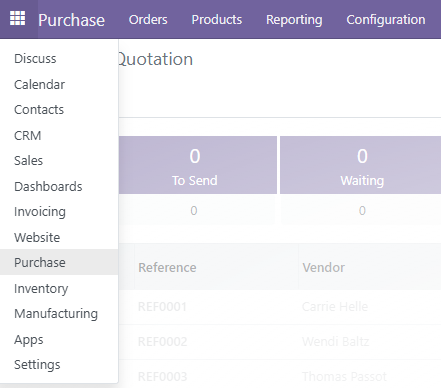
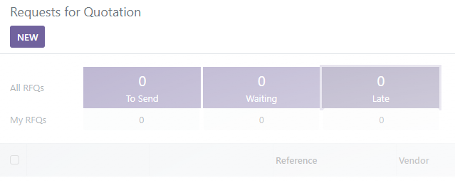
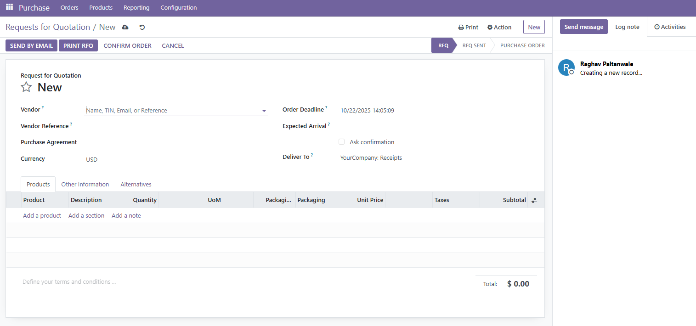
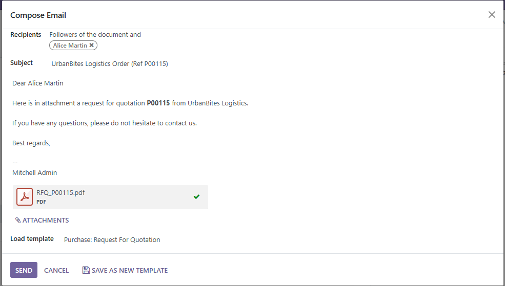
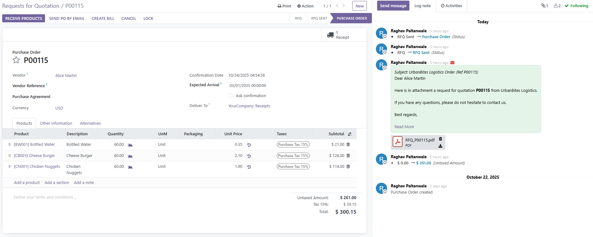
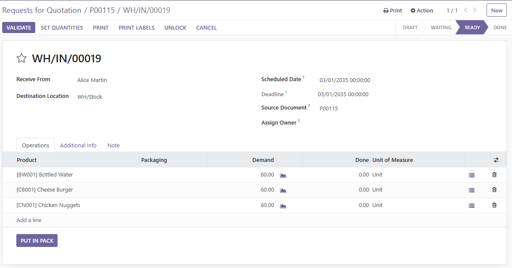
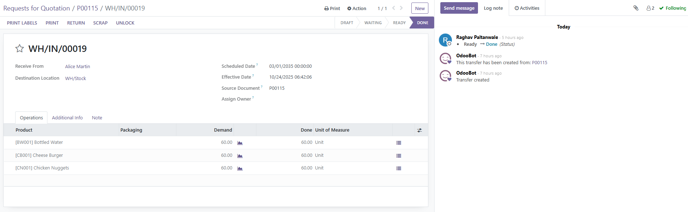

# Procure 2 Pay - Odoo 16

## 📚 Table of Contents

- [Background Business Case](#background-business-case)
- [Goals](#goals)
- [Process](#process)
  - [Requests for Quotation](#1️⃣-Requests-for-Quotation)
    - [Create RFQ](#Create-RFQ)
    - [Fill out RFQ](#Fill-out-RFQ)
    - [Send RFQ by email](#Send-RFQ-by-email)
    - [Confirm order](#Confirm-order)
  - [Purchase Order](#2️⃣-Purchase-Order)
    - [Receive Products](#Receive-Products)
    - [Validate Order](#Validate-Order)
  - [Vendor Bill Creation](#3️⃣-Vendor-Bill-Creation)

## Background Business Case

This is a supply chain business case for the hypothetical company Banana Inc., a grocery store. From start to finish, this document describes how vendor sourcing, purchasing, product receipt, vendor billing, and supplier payment are implemented in Odoo 16’s Procure to Pay workflow.

## Goals

The goal of this project is to establish a new workflow for vendor sourcing, purchasing, product receipt, vendor billing, and supplier payment to improve the efficiency and accuracy of Banana Inc.’s procurement operations. Prior to this, the company relied on a fragmented and outdated purchasing system. This implementation will add value by enhancing supplier coordination, streamlining purchase approvals, improving inventory accuracy, and ensuring timely and transparent payments to vendors.

## Process

### 1️⃣ Requests for Quotation

#### Create RFQ

Start by creating Requests for Quotation (RFQs).
To do this, open the Purchase module from the dropdown list of modules on the top left.

Now, click on the button "New" to create an RFQ.

#### Fill out RFQ

This opens the form for a new RFQ.

Fill out the necessary fields, such as Vendor and Order Deadline. Next, start adding products to be purchased. Then, appropriately update the quantities.

#### Send RFQ by email

Now that the RFQ is filled out, click on the button "Send by email" on the top left. This opens a dialog box titled: "Compose Email". Click on Send (bottom left); this sends the RFQ to the vendor (in this case, Alice Martin) by email.

#### Confirm order

Click on "Confirm Order" on top left. This converts the RFQ into a purchase order.

### 2️⃣ Purchase Order

#### Receive Products

Now that the purchase order has been created, click on "Receive Products" on the top left of the form above. This opens the receipt for the purchase order, given below.

#### Validate Order

Update the quantities in the "Done" column to match the quantities in the "Demand" column. Next, click "Validate" on the top left.

### 3️⃣ Vendor Bill Creation

