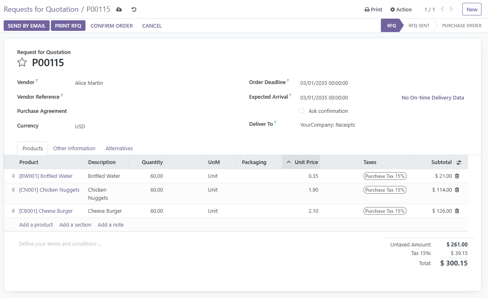

# Procure 2 Pay - Odoo 16

## 📚 Table of Contents

- [Background Business Case](#background-business-case)
- [Goals](#goals)
- [Process](#process)
  - [Requests for Quotation](#1️⃣-Requests--for--Quotation)

## Background Business Case

This is a supply chain business case for the hypothetical company Banana Inc., a grocery store. From start to finish, this document describes how vendor sourcing, purchasing, product receipt, vendor billing, and supplier payment are implemented in Odoo 16’s Procure to Pay workflow.

## Goals

The goal of this project is to establish a new workflow for vendor sourcing, purchasing, product receipt, vendor billing, and supplier payment to improve the efficiency and accuracy of Banana Inc.’s procurement operations. Prior to this, the company relied on a fragmented and outdated purchasing system. This implementation will add value by enhancing supplier coordination, streamlining purchase approvals, improving inventory accuracy, and ensuring timely and transparent payments to vendors.

## Process

### 1️⃣ Requests for Quotation

Start by creating Requests for Quotation (RFQs).
To do this, open the Purchase module from the dropdown list of modules on the top left.

Now, click on the button "New" to create an RFQ.

This opens the form for a new RFQ.

Fill out the necessary fields, such as Vendor and Order Deadline. Next, start adding products to be purchased. Then, appropriately update the quantities.

Now that the RFQ is filled out, click on the button "Send by email" on the top left. 

This opens a dialog box titled: "Compose Email". Click on Send (bottom left); this sends the RFQ to the vendor (in this case, Alice Martin) by email.
